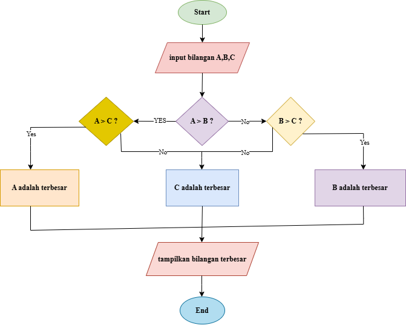

# Program 1 Menemukan Bilangan Terbesar dari 3 Variabel
Program 1 untuk menentukan bilangan terbesar dari tiga angka yang diberikan oleh pengguna. Dengan menggunakan struktur kontrol sederhana, program ini akan membandingkan ketiga bilangan dan mengidentifikasi mana yang memiliki nilai tertinggi.

## Deskripsi Program 1
Program ini di buat menggunakan bahasa Python dengan fitur:
* Minta pengguna untuk memasukkan tiga bilangan.
* Simpan nilai-nilai tersebut ke dalam variabel.
* Bandingkan ketiga variabel menggunakan struktur if untuk menentukan nilai maksimum.
* Tampilkan hasilnya ke layar.

## Flowchart Programan


## Cara Kerja Program 1
Program ini mencari bilangan terbesar dari tiga angka yang dimasukkan pengguna. Berikut cara kerjanya secara ringkas:

• Pengguna memasukkan tiga angka yang disimpan di variabel a, b, dan c.
• Program membandingkan a, b, dan c menggunakan beberapa kondisi if.
• Jika a lebih besar dari b, program akan mengecek apakah a juga lebih besar dari c. Jika iya, maka a adalah yang terbesar; jika tidak, maka c adalah yang terbesar.
• Jika a tidak lebih besar dari b, program membandingkan b dengan c untuk menentukan apakah b atau c yang terbesar.
• Program mencetak bilangan terbesar.

Hasil akhirnya adalah nilai terbesar dari ketiga angka yang dimasukkan.

## Kode Program
```python
a = int(input ("masukan angka: "))

b = int(input ("masukan angka: "))

c = int(input ("masukan angka: "))

if a > b:
    if a > c :
        terbesar = a
    else:
        terbesar = c       
else:
    if b > c:
        terbesar = b
    else:
        terbesar = c

print ( f"Bilangan terbesar adalah {terbesar}")
```

## Output Program
````
masukan angka: 100
masukan angka: 200
masukan angka: 300
Bilangan terbesar adalah 300
