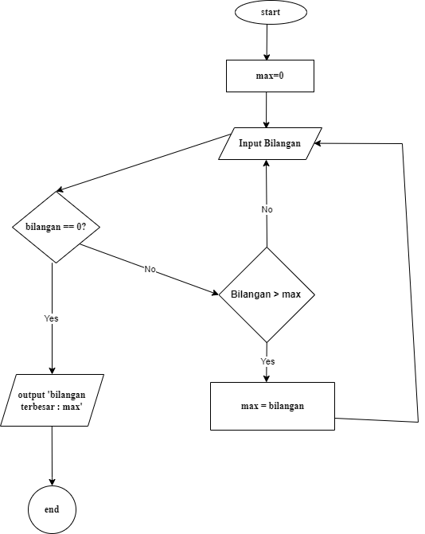

# Program Mencari Bilangan Terbesar
Program sederhana untuk mencari nilai terbesar dari sekumpulan bilangan yang dimasukkan oleh pengguna menggunakan loop while True dan break statement.
## Deskripsi Program
Program ini dibuat menggunakan bahasa Python dengan fitur:

- Menggunakan while True untuk perulangan tak terbatas
- Menggunakan break statement untuk menghentikan program
- Membandingkan setiap input dengan nilai maksimum yang tersimpan
- Menampilkan bilangan terbesar yang ditemukan

## flowchart programan
  

  # Kode Program
 ```python
max = 0
bilangan = int(input("masukan bilangan :"))
while bilangan != 0 :
    if bilangan > max :
        max = bilangan
    bilangan = int(input("masukan bilangan :"))

print (f"bilangan terbesar= {max}")
```

## output Program
````
masukan bilangan :10
masukan bilangan :20
masukan bilangan :40
masukan bilangan :300
masukan bilangan :60
masukan bilangan :0
bilangan terbesar= 300
````

# cara kerja program
max = 0: Variabel max diset ke 0. Variabel ini akan digunakan untuk menyimpan nilai bilangan terbesar yang ditemukan.bilangan = int(input("masukan bilangan :")): Program meminta pengguna memasukkan bilangan pertama.Selama bilangan yang dimasukkan oleh pengguna bukan 0, program akan terus meminta input bilangan berikutnya.if bilangan > max: memeriksa apakah bilangan yang baru diinput lebih besar dari nilai max saat ini. Jika benar, maka max diperbarui dengan nilai bilangan tersebut.Jika bilangan lebih kecil atau sama dengan max, program akan meminta bilangan baru tanpa memperbarui max.Ketika pengguna memasukkan bilangan 0, loop berhenti karena kondisi bilangan != 0 menjadi False.Setelah loop selesai, program mencetak nilai max yang berisi bilangan terbesar yang dimasukkan oleh pengguna.
